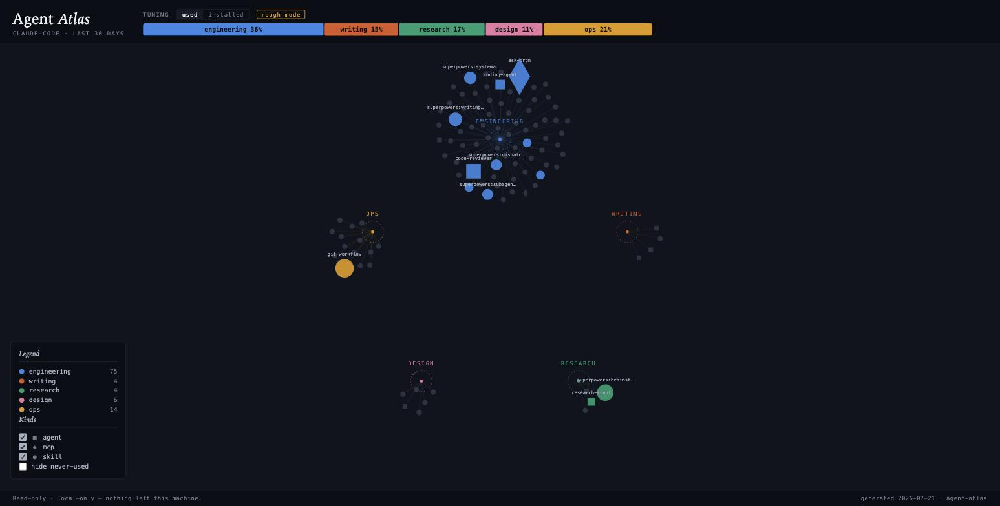
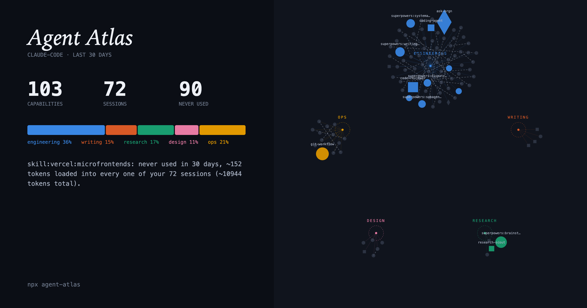

# Agent Atlas

**A map of your AI setup.** Agent Atlas scans your AI coding environment and turns it into an interactive mind map — so you can see, at a glance, what your agents and skills are actually good at, what you never use, and what's missing.



You've probably installed dozens of skills, subagents, and MCP servers into your AI tools. But do you actually know what your setup can do? Agent Atlas reads your configuration and your session history, then draws your whole stack as a living map: every skill, agent, and tool as a node, grouped by what it's for, sized by how often you actually use it.

In one picture you can answer questions you currently can't:

- **What is my setup tuned for?** More engineering than writing? Any research capability at all?
- **What am I paying for but never using?** Every installed MCP server loads its tool schemas into context in every session — unused servers silently cost you tokens every single day.
- **Where are the overlaps and gaps?** Two skills doing nearly the same job; whole capability areas with zero coverage.

## Quick start

```bash
npx agent-atlas
```

That's it. No config, no account. Works on **Claude Code** setups today (Cursor and friends are on the roadmap — the scanner is built behind an adapter interface).

Don't have an Anthropic API key handy? It still works:

```bash
npx agent-atlas --rough   # keyword-based classification, no API call at all
```

## Privacy — read this part

Agent Atlas is **read-only and local-only**:

- It never modifies anything on your machine.
- Nothing leaves your machine except one optional classification API call — and that call sends **only the names and descriptions** of your skills/agents/servers. Your session transcripts, your code, and your prompts are never sent anywhere.
- With `--rough`, nothing leaves your machine at all.
- It's open source (MIT). Don't take our word for any of this — read the code.

## How it works

Four stages, one pipeline:

```
Scanner  →  Usage Miner  →  Classifier  →  Renderer
(what's      (what actually   (what each     (the map +
installed)    fires)           piece is for)   diagnostics)
```

1. **Scanner** — inventories skills, subagents, MCP servers, and hooks from your `~/.claude` configuration (plus the current project's `.claude/`).
2. **Usage Miner** — streams your local session transcripts and counts what actually fired in the last 30 days (`--days` to change the window).
3. **Classifier** — one cheap LLM pass scores every item across five capability axes: **engineering, writing, research, design, ops**. Results are cached by content hash, so re-runs are fast and nearly free. Got a classification wrong? Pin the right one in `~/.agent-atlas/overrides.json` — overrides always win.
4. **Renderer** — draws the interactive map: clusters by capability, node size = usage, grey = dead weight, plus a "tuning bar" summarizing your whole stack (`Engineering 61% · Research 17% · …`). Below the map, three diagnostic lists: **dead weight** (with estimated tokens wasted per session), **overlaps** (near-duplicate skills/agents), and **gaps** (capability axes you barely cover). The "Share card" button exports a PNG:



## Usage

```bash
npx agent-atlas                  # scan, classify, open the map
npx agent-atlas --json           # dump inventory + usage + classification as JSON
npx agent-atlas --days 90        # widen the usage window
npx agent-atlas --rough          # skip the API, use keyword heuristics
npx agent-atlas --atlas-dir DIR  # custom location for cache + overrides
```

Classification uses your `ANTHROPIC_API_KEY` environment variable if set; otherwise it falls back to rough mode automatically.

## Status / roadmap

| Milestone | What | Status |
|---|---|---|
| M1 | Scanner + Usage Miner (`--json` output) | ✅ done |
| M2 | Classifier — LLM pass, cache, overrides, no-key fallback | ✅ done |
| M3 | Renderer — interactive map + tuning bar (`atlas.html`) | ✅ done |
| M4 | Diagnostics (dead weight, overlaps, gaps) + shareable card | ✅ done |
| v2 | Adapters for Cursor, Codex CLI, Gemini CLI; recommendations | 💭 planned |

The full design lives in [SPEC.md](SPEC.md).

## Development

```bash
npm install
npm run build     # tsc → dist/
npm test          # vitest, runs against the fixture tree in fixtures/
```

All tests run against a fake `~/.claude` tree in `fixtures/` — nothing in the test suite touches your real setup. If you're adding a scanner or classifier change, extend the fixtures and the expected outputs alongside it.

Contributions welcome — especially adapter implementations for other AI coding tools and hand-labeled classification examples for the rubric.

## Teams

Curious what your whole engineering team's AI stack looks like — aggregate maps, redundant spend, shadow tooling? I'm exploring a team version. Email [alfredemmanuelinyang@gmail.com](mailto:alfredemmanuelinyang@gmail.com).

## License

[MIT](LICENSE) © 2026 Alfred Emmanuel
